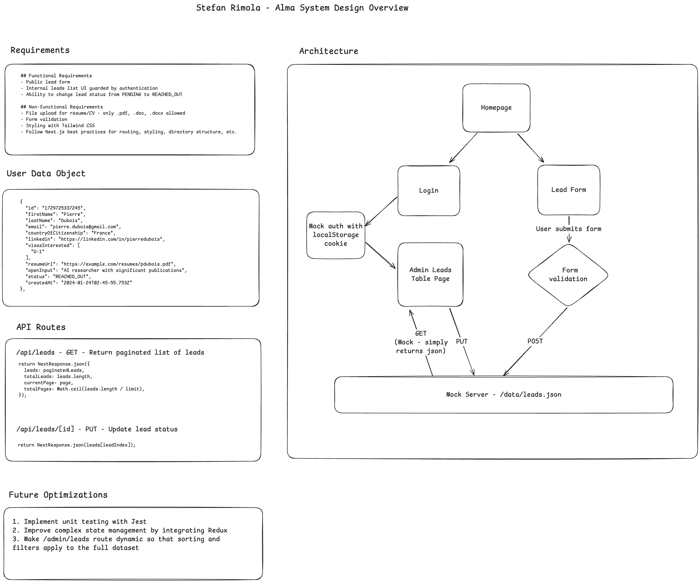

This is a [Next.js](https://nextjs.org) project bootstrapped with [`create-next-app`](https://nextjs.org/docs/app/api-reference/cli/create-next-app).

## Getting Started

First, create a .env file and add the following:

```bash
NEXT_PUBLIC_AUTH_TOKEN=mock-token
NEXT_PUBLIC_ADMIN_USERNAME=admin
NEXT_PUBLIC_ADMIN_PASSWORD=password
```

Next, install dependencies and run the development server:

```bash
npm install

npm run dev
```

Open [http://localhost:3000](http://localhost:3000) with your browser to see the result.

Click "Submit your information now" to navigate to /lead-form.

Enter the required fields and click "Submit" to submit the form.

Click "Admin Login" to navigate to /admin/login to login.

Once logged in, you will be redirected to /admin/leads to view the leads.

The most recent leads are at the top of the list.

You can search, filter, and sort the leads.

You can also change the status of a lead from PENDING to REACHED_OUT and vice versa.

Go back home by clicking Alma logo or logging out by clicking "Admin" in the bottom left.

## Functional Requirements
- Public lead form
- Internal leads list UI guarded by authentication - if you try to access /admin/leads without the auth token you'll be redirected to the login page
- Ability to change lead status from PENDING to REACHED_OUT

## Non-functional Requirements
- File upload for resume/CV - only .pdf, .doc, .docx allowed
- Form validation
- Responsive styling with Tailwind CSS
- Follow Next.js best practices for routing, styling, directory structure, etc.

## Bonus Points
- [x] Implement API routes using Next.js API
- [ ] Use [JsonForms](https://jsonforms.io/) to implement the lead form in a configuration driven way (JsonForms is a configuration driven UI component lib)
- [ ] Use a state management library (e.g., Redux) to manage the state of the leads.
- [ ] Implement unit tests for key components and functionalities.
- [x] Add responsiveness to ensure the application works well on different screen sizes.
- [x] Use TypeScript for type safety.
- [x] Implement form validation feedback (e.g., show error messages when fields are not filled in correctly).
- [x] Document the system design.

## Next Steps
If I had more time, I would:
- Update /admin/leads to be a dynamic route. Right now it's a static page which is why the search, filter and sort functionality only affects the given page. 
- Add unit tests using Jest.
- Improve state management using Redux.
- Update the lead form to use JsonForms.

## System Design
